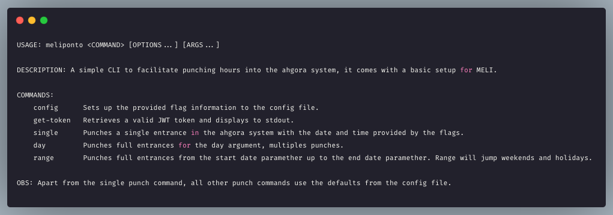
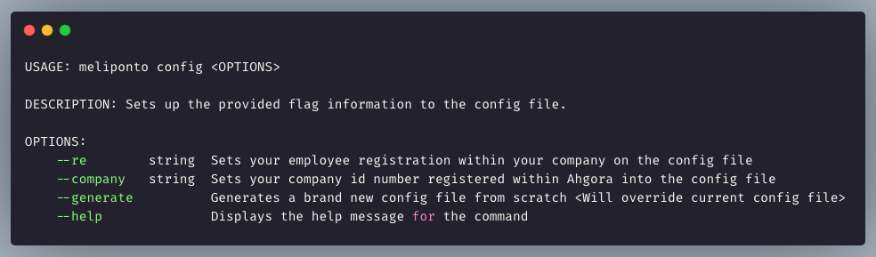
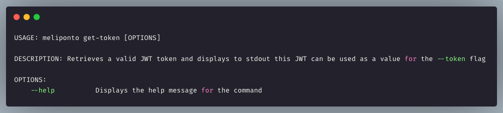
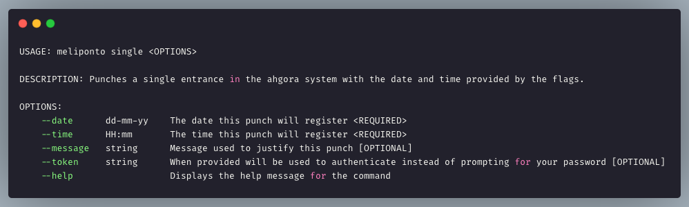
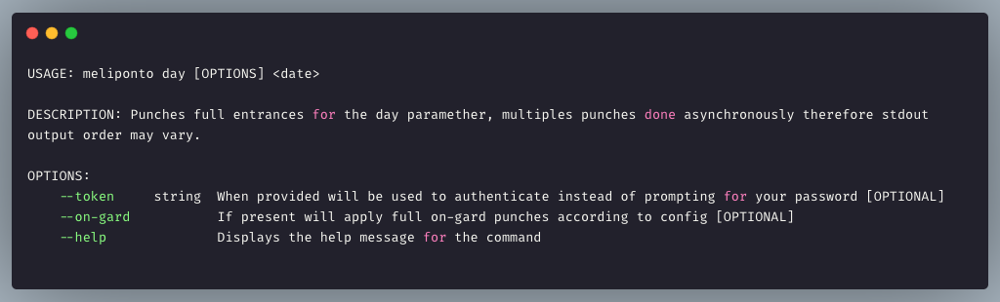
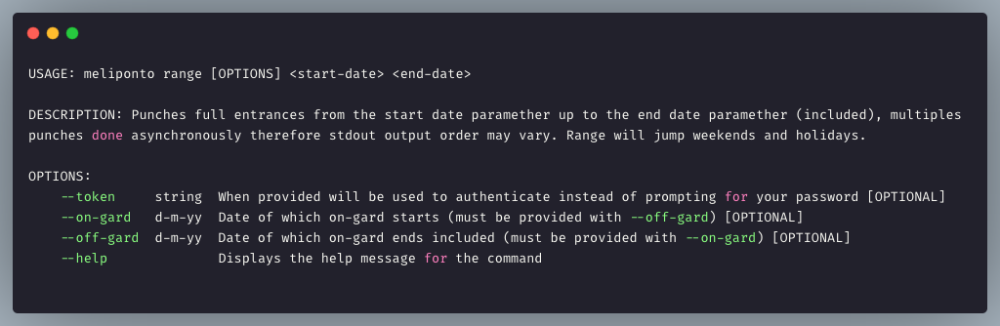

```
 __   __  _______  ___      ___  _______  _______  __    _  _______  _______ 
|  |_|  ||       ||   |    |   ||       ||       ||  |  | ||       ||       |
|       ||    ___||   |    |   ||    _  ||   _   ||   |_| ||_     _||   _   |
|       ||   |___ |   |    |   ||   |_| ||  | |  ||       |  |   |  |  | |  |
|       ||    ___||   |___ |   ||    ___||  |_|  ||  _    |  |   |  |  |_|  |
| ||_|| ||   |___ |       ||   ||   |    |       || | |   |  |   |  |       |
|_|   |_||_______||_______||___||___|    |_______||_|  |__|  |___|  |_______|

```


A simple CLI to facilitate punching hours into the ahgora system

## **Installation and setup**
Install meliponto via homebrew
```sh
brew tap cmoscofian/meli
brew install meliponto
```

Setup your employee registration number
```sh
meliponto config --re {your_employee_registration}
```

---
## **Basic Usage**


---
## **Executable Commands**


## **Setup Configuration Command (*`config`*)**


**Example**:

```
$ meliponto config --re 123456
```
Response:
```
Config file updated successfully!
```

---
## **Get Token Command (*`get-token`*)**


***PS**: You will be prompted for your **password***

**Example**:
```
$ meliponto get-token
Enter your password: 
```
Response:
```
$ eyJ0eXAiOiJKV1QiLCJhbGciOiJSUzI1NiJ9...
```

---
## **Single Punch Command (*`single`*)**


***PS**: If --token is not provided you will be prompted for your **password***.

**Example**:
```
$ meliponto single --date 01-05-18 --time 18:48
Enter your password:
```
Response:
```
Punch successfull! [id: 5f0678b4c8fec13eba7f6502][date: 2018-05-01][message: Final de jornada][state: PENDENTE]
```

---
## **Day Punch Command (`day`)**


***PS**: If --token is not provided you will be prompted for your **password***.

**Example**:
```
$ meliponto day --on-gard 01-01-20
Enter your password:
```
Response:
```
Punch successfull! [id: 5f0687b0826c2a66695abbd2][date: 2020-01-01][message: Guardia][state: PENDENTE]
Punch successfull! [id: 5f0687b0a3f77153f01746e7][date: 2020-01-01][message: Início de jornada][state: PENDENTE]
Punch successfull! [id: 5f0687b01dd4c74dbe6e6be3][date: 2020-01-01][message: Final de jornada][state: PENDENTE]
Punch successfull! [id: 5f0687b08557bd075e792876][date: 2020-01-01][message: Guardia][state: PENDENTE]
Punch successfull! [id: 5f0687b054203527067ea612][date: 2020-01-01][message: Retorno do almoço][state: PENDENTE]
Punch successfull! [id: 5f0687b03eee5a3fa055a67b][date: 2020-01-01][message: Guardia][state: PENDENTE]
Punch successfull! [id: 5f0687b0d8f5c011517e23f4][date: 2020-01-01][message: Saída para almoço][state: PENDENTE]
```

---
## **Range Punch Command (`range`)**


***PS**: If --token is not provided you will be prompted for your **password***.

**Example**:
```
$ meliponto range --on-gard 08-06-20 --off-gard 15-06-20 01-06-20 30-06-20
Enter your password:
```
Response:
```
Punch successfull! [id: 5f0687b0826c2a66695abbd2][date: 2020-06-01][message: Guardia][state: PENDENTE]
Punch successfull! [id: 5f0687b0a3f77153f01746e7][date: 2020-06-01][message: Início de jornada][state: PENDENTE]
...
...
...
Punch successfull! [id: 5f0687b0d8f5c011517e23f4][date: 2020-06-30][message: Saída para almoço][state: PENDENTE]
```

---
## **Config file** - `meliponto.json`
The config file contains all default information for the punches, employee registration number, company number, default hours and messages to regular and gard times and holidays.

This file resides on the folder `/usr/local/etc` and has the following structure:

*`meliponto.json`*
```json
{
    "user_id": "string",
    "company_id": "string",
    "default": {
        "messages": {
            "work_start": "string",
            "lunch_start": "string",
            "lunch_end": "string",
            "work_end": "string"
        },
        "hours": {
            "work_start": "string <HH:mm>",
            "lunch_start": "string <HH:mm>",
            "lunch_end": "string <HH:mm>",
            "work_end": "string <HH:mm>"
        }
    },
    "gard": {
        "messages": {
            "default": "string"
        },
        "hours": {
            "begin": [
                {
                    "start": "string <HH:mm>",
                    "end": "string <HH:mm>"
                }
            ],
            "weekday": [
                {
                    "start": "string <HH:mm>",
                    "end": "string <HH:mm>"
                }
            ],
            "saturday": [
                {
                    "start": "string <HH:mm>",
                    "end": "string <HH:mm>"
                }
            ],
            "sunday": [
                {
                    "start": "string <HH:mm>",
                    "end": "string <HH:mm>"
                }
            ],
            "holiday": [
                {
                    "start": "string <HH:mm>",
                    "end": "string <HH:mm>"
                }
            ],
            "finish": [
                {
                    "start": "string <HH:mm>",
                    "end": "string <HH:mm>"
                }
            ]
        }
    },
    "holidays": [
        "string <dd-mm-yy>"
    ]
}
```

# **TO-DO's**:
- Create week command to allow punch a full-week at once
- Create month command to allow punch a full-month at once
- Create gard command to allow punch on-gard specifically
- Allow to pass a path to config file as a flag (flexible)
- Delete a punch by ID
- Approve a closed month
- Create a functionality to retrieve punches and iteractivelly asks if should delete old punch or skip punching the new or keeping both